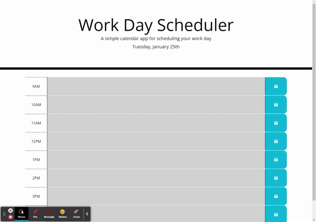

# datePlanner

## Link

https://aditore.github.io/datePlanner/

## Description

For our week 5 assignment in bootcamp we were required to create a functioning date planner that would save to local storage and hold the contents on the page even as the page was reloaded.

My motivation for building this was to learn new web-apis and apply them into my work

This application provides help to anyone who would like to save events that they have throughout the workday.

I learned how to access the current date and time with moment.js and how to build functionality using time with local storage. I also learned how to apply bootstrap to my CSS styles.

## Usage

By clicking on a textarea within the website, you are able to type out any activity or event that you need done within that day. Click the save button with the mouse to add the typed event to local storage. After reloading the page the saved text to local storage should still show on the website.

